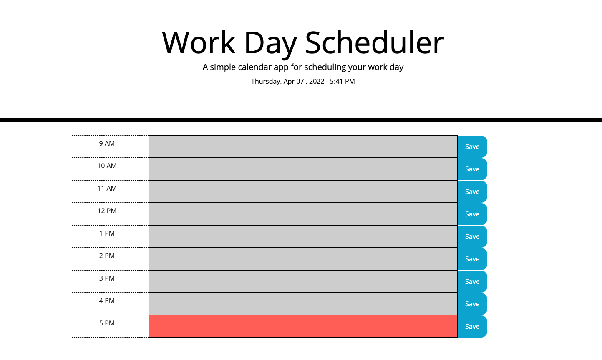
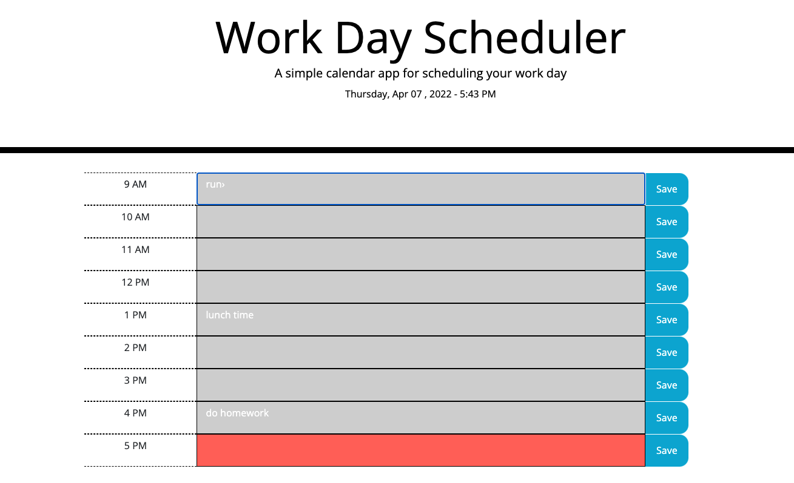

# 05 Third-Party APIs: Work Day Scheduler
## Saghar Behinaein
## Your Task

Create a simple calendar application that allows a user to save events for each hour of the day by modifying starter code. This app will run in the browser and feature dynamically updated HTML and CSS powered by jQuery.

You'll need to use the [Moment.js](https://momentjs.com/) library to work with date and time. Be sure to read the documentation carefully and concentrate on using Moment.js in the browser.

## User Story

```md
AS AN employee with a busy schedule
I WANT to add important events to a daily planner
SO THAT I can manage my time effectively
```

## Acceptance Criteria

```md
GIVEN I am using a daily planner to create a schedule
WHEN I open the planner
THEN the current day is displayed at the top of the calendar
WHEN I scroll down
THEN I am presented with timeblocks for standard business hours
WHEN I view the timeblocks for that day
THEN each timeblock is color coded to indicate whether it is in the past, present, or future
WHEN I click into a timeblock
THEN I can enter an event
WHEN I click the save button for that timeblock
THEN the text for that event is saved in local storage
WHEN I refresh the page
THEN the saved events persist
```

The following animation demonstrates the application functionality:


## My Work
* When the user opens the planner, the current day is displayed at the top of the calendar
* The page resented with time blocks for standard business hours(9 Am to 5 Pm)
* Each time block is color-coded to indicate whether it is in the past (gray), present (red), or future (green)
  

* By clicking into a time block, and entering the task of the time, it saves by clicking the save button
* it saves the information to the local storage
* By refreshing the page, the saved task present in a correct time task





*  GitHub repository name: Day-Planner-April-7
*  The URL to the website is: https://saghar-b.github.io/Day-Planner-April-7/
*  The URL of the GitHub repository : https://github.com/saghar-b/Day-Planner-April-7